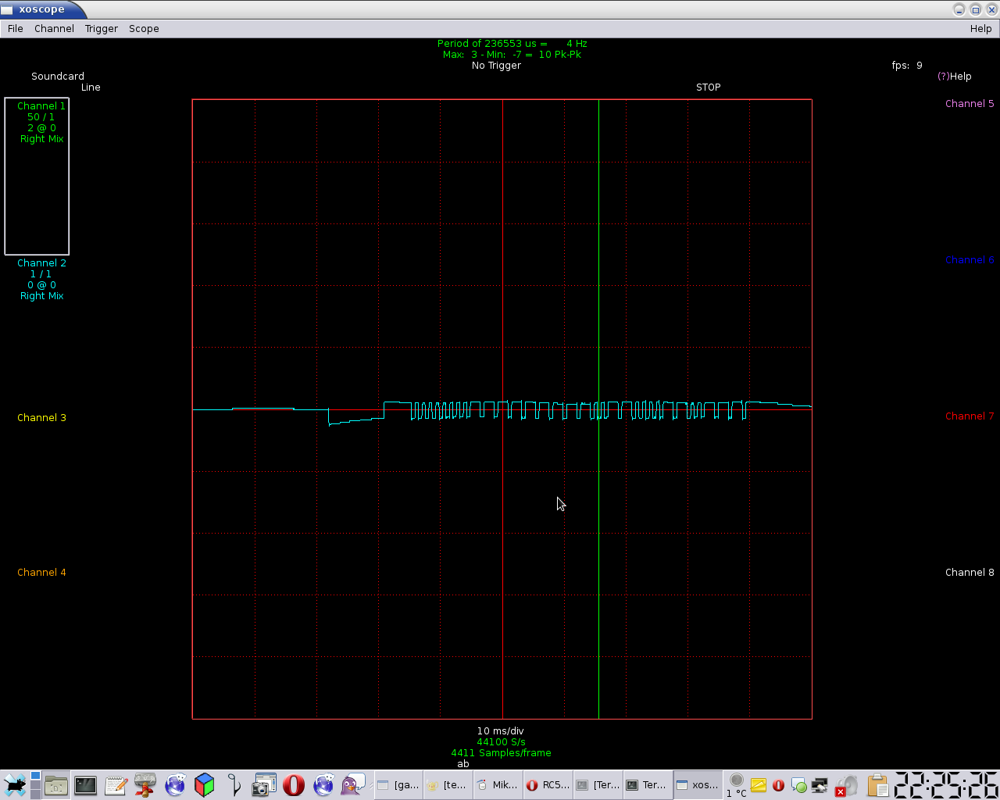

# irNEC-reader
The microcontroler is reading the NEC protocol used in IR remote. The led lights up when the button code is correct

## Analyzing of the ir protocol

## Used ping
* PORTD.2 - ir sensor
* PORTB.0 - led light on when the code is correct
* PORTB.1 - led light on when the button is hold
